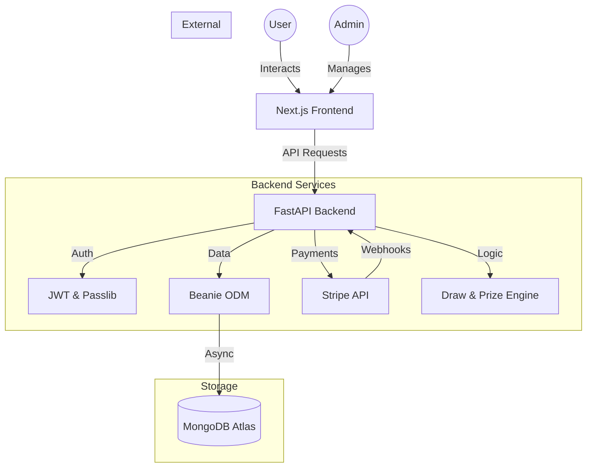
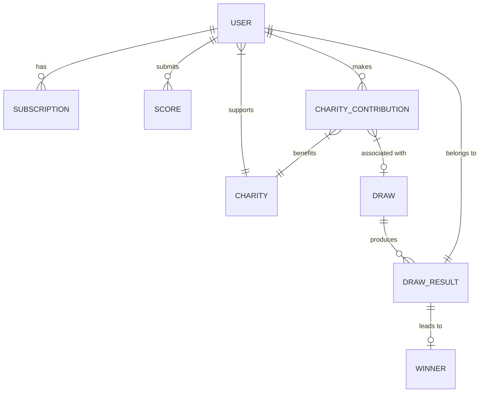
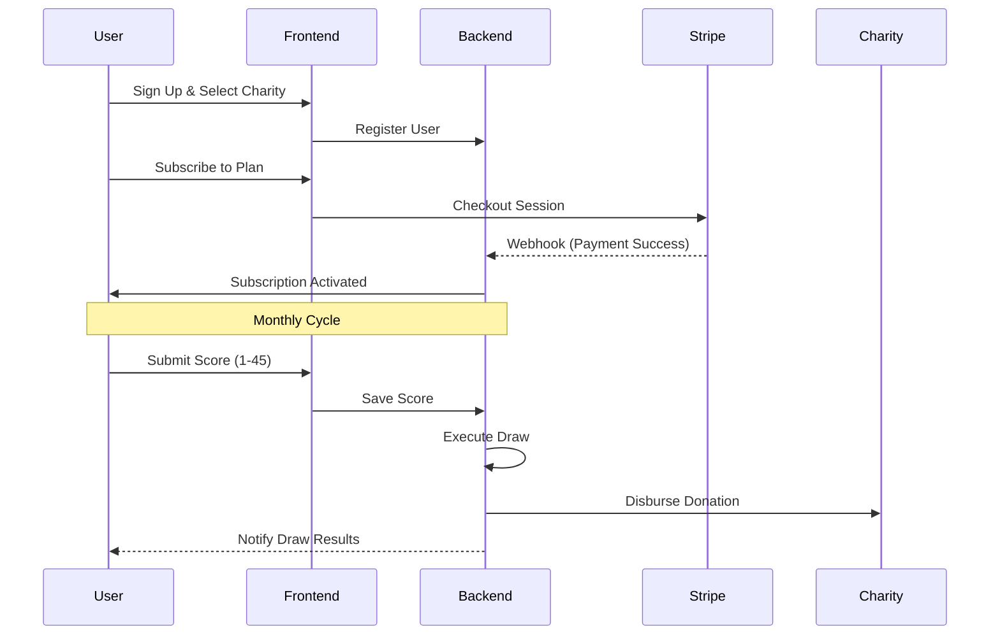

# 🏆 Digital Heroes - Impact Through Competition

[](https://nextjs.org/)
[](https://fastapi.tiangolo.com/)
[](https://www.mongodb.com/)
[](https://stripe.com/)
[](https://tailwindcss.com/)

**Digital Heroes** is a premium, enterprise-grade SaaS platform that bridges the gap between competitive performance and charitable giving. Users participate in monthly draws based on their performance metrics (like Stableford golf scores) while directly supporting vetted charities.

---

## ✨ Features

-   **🎯 Score-Based Draws**: Submit your performance scores (e.g., Stableford golf scores) to enter exclusive monthly prize draws.
-   **🎗️ Charity Integration**: A percentage of every subscription and win-share is automatically routed to your chosen charity.
-   **💳 Subscription Engine**: Powered by Stripe for seamless monthly and yearly membership management.
-   **📊 Real-time Analytics**: Beautiful dashboards for both users and administrators to track impact and draw results.
-   **🔐 Enterprise Security**: JWT-based authentication with Role-Based Access Control (RBAC).
-   **🚀 Algorithmic Fair Play**: Transparent winning number generation using verifiable random or algorithmic modes.

---

## 🧩 Core Modules

| Module | Description | Tech Highlight |
| :--- | :--- | :--- |
| **User Dashboard** | Personal impact tracking and score entry. | Framer Motion & React Query |
| **Draw Engine** | Automated prize draws and winner verification. | FastAPI Background Tasks |
| **Charity Portal** | Management of vetted charities and donation routing. | Beanie Link Models |
| **Payment Gateway** | Robust subscription management and webhooks. | Stripe API Integration |
| **Admin Suite** | High-level platform monitoring and draw controls. | Next.js Server Components |

---

## 🏗️ System Architecture



---

## 📊 Data Relationship Graph



---

## 🔄 User Journey



---

## 🛠️ Tech Stack

### Frontend
- **Framework**: [Next.js 15+](https://nextjs.org/) (App Router)
- **State Management**: [TanStack Query v5](https://tanstack.com/query/latest)
- **Styling**: [Tailwind CSS 4.0](https://tailwindcss.com/)
- **Animations**: [Framer Motion](https://www.framer.com/motion/)
- **Forms**: [React Hook Form](https://react-hook-form.com/) + [Zod](https://zod.dev/)

### Backend
- **Framework**: [FastAPI](https://fastapi.tiangolo.com/) (Python 3.11+)
- **Database**: [MongoDB](https://www.mongodb.com/) with [Beanie ODM](https://beanie-odm.dev/)
- **Task Scheduling**: Async logic for draw simulations
- **Payments**: [Stripe SDK](https://stripe.com/docs/api)
- **Validation**: [Pydantic v2](https://docs.pydantic.dev/latest/)

---

## 🚀 Getting Started

### 1. Backend Setup
```bash
cd Backend
python -m venv venv
source venv/bin/activate  # venv\Scripts\activate on Windows
pip install -r requirements.txt
cp .env.example .env
# Edit .env with your MongoDB & Stripe keys
uvicorn app.main:app --reload
```

### 2. Frontend Setup
```bash
cd frontend
npm install
cp .env.example .env.local
# Set NEXT_PUBLIC_API_URL=http://localhost:8000
npm run dev
```

---

## 📁 Project Structure

```text
Digital_heros/
├── Backend/
│   ├── app/
│   │   ├── api/          # Route handlers (v1)
│   │   ├── models/       # Beanie Document models
│   │   ├── services/     # Business logic (Stripe, Draw logic)
│   │   └── schemas/      # Pydantic data validation
│   └── tests/            # Pytest suite
└── frontend/
    ├── src/
    │   ├── app/          # Next.js App Router pages
    │   ├── components/   # Atomic UI components
    │   └── services/     # Axios API abstraction
    └── public/           # Static assets
```

---

## 📄 License & Contribution

This project is proprietary. For contribution guidelines or licensing inquiries, please contact the development team.

---
<p align="center">Made with ❤️ for the Digital Heroes Community</p>
